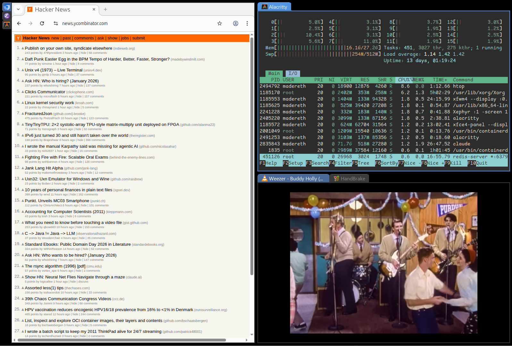

# ttwm

A minimal X11 tiling window manager with tabbed windows, inspired by [Notion](https://notionwm.net/).

ttwm combines the efficiency of tiling layouts with tabbed window organization. Multiple windows can share the same screen space as tabs within frames, and frames can be split horizontally or vertically to create complex layouts.



## Features

- **Tabbed windows**: Stack multiple windows in a single frame, switch between them like browser tabs
- **Tiling layout**: Binary tree-based splitting (horizontal/vertical) with adjustable ratios
- **Spatial navigation**: Move focus between frames using arrow keys
- **9 workspaces**: Independent virtual desktops with their own layouts
- **Mouse support**: Drag gaps to resize splits, click tabs to focus
- **Configurable**: TOML-based configuration for keybindings, colors, and appearance
- **IPC interface**: Control the WM programmatically via Unix socket
- **Pseudo-transparency**: Tab bars sample the root window for a transparency effect
- **FreeType fonts**: Anti-aliased text rendering in tab bars

## Requirements

- Rust 1.70+
- X11 development libraries
- FreeType development libraries

### Debian/Ubuntu

```bash
sudo apt install build-essential libx11-dev libxcb1-dev libfreetype6-dev
```

### Arch Linux

```bash
sudo pacman -S base-devel libx11 libxcb freetype2
```

## Building

```bash
git clone https://github.com/adereth/ttwm.git
cd ttwm
cargo build --release
```

Binaries are output to `target/release/`:
- `ttwm` - The window manager
- `ttwmctl` - CLI control tool

## Quick Start

1. Copy the example config:
   ```bash
   mkdir -p ~/.config/ttwm
   cp config.toml.example ~/.config/ttwm/config.toml
   ```

2. Start ttwm (from `.xinitrc` or display manager)

3. Basic keybindings:
   | Key | Action |
   |-----|--------|
   | `Mod4+x` | Open terminal |
   | `Mod4+s` | Split horizontally |
   | `Mod4+v` | Split vertically |
   | `Mod4+Arrow` | Focus frame in direction |
   | `Mod4+Page_Down/Up` | Cycle tabs |
   | `Mod4+q` | Close window |
   | `Mod4+Shift+q` | Quit ttwm |

## Documentation

- [User Guide](docs/USER_GUIDE.md) - Installation, configuration, and usage
- [Developer Guide](docs/DEVELOPER_GUIDE.md) - Architecture and contributing

## Configuration

Edit `~/.config/ttwm/config.toml`:

```toml
[general]
terminal = "alacritty"

[appearance]
gap = 8
tab_bar_height = 26
tab_font = "Segoe UI"

[colors]
tab_focused_bg = "#5294e2"
border_focused = "#5294e2"

[keybindings]
spawn_terminal = "Mod4+x"
split_horizontal = "Mod4+s"
```

See [config.toml.example](config.toml.example) for all options.

## IPC

Control ttwm with `ttwmctl`:

```bash
ttwmctl state          # Get WM state as JSON
ttwmctl windows        # List all windows
ttwmctl split horizontal
ttwmctl focus-frame left
```

## License

MIT
